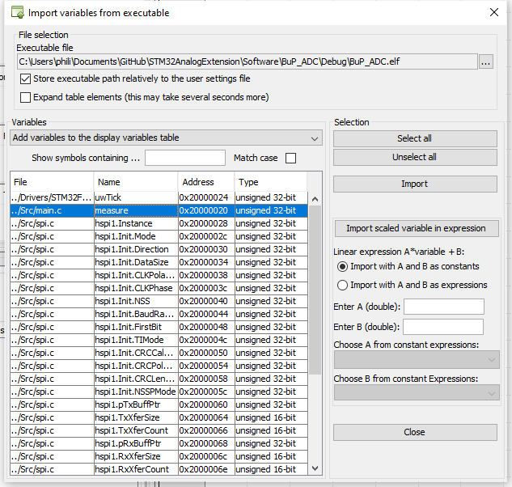

# STM32AnalogExtension
In diesem Repository befinden sich die Daten für eine analog Erweiterung, bestehend aus einem externen ADC für das STM32F0-Discovery Board. 
Im weiteren ist die komplette Dokumentation, so dass die Projektschritte verstanden werden können und auch das Projekt verständlich wird. 

Das Projekt ist OpenSource & darf frei verwendet (und so auch gerne verbessert) werden. 
Ich hoffe viel Freude damit zu bereiten. 
:)


# Projektdokumentation

## Aufgabe
Für die Bereichsübergreifende Projekte der Schule sollte eine Erweiterung für das STM32F051Discovery Kit erstellt werden. 
Dieses Projekt ist eine Analoge Erweiterung mit einem 24Bit 4kSps externen ADC. Dabei ist wichtig dass die Erweiterung mit SPI Angesteuert wird. 
Mehr im Fokus des Projektes stand die Einfachheit, so das das Produkt einfach angewendet werden kann, als es Sehr genau ist. 
So wurde bei der Temperaturmessung auf die Konstantstromquelle Verzichtet, jedoch können zukünftige Anwender die tolle Auflösung mit allen Problemen und Hürden selbst erfahren. 

### Vorgaben
-	Es soll nur eine Seite für Anschlüsse genutzt werden
-	Die Erweiterungsplatine sitzt also zur rechten oder linken Seite des STM32F0-Board
-	Die Seite wird durch die Versorgungsspannung vorgegeben, wenn möglich 3V
-	Platinendicke 1,6mm
-	Lagenanzahl: 2
-	Bestückungsdruck: Schriftgrösse 1mm  Name der Bauteile, Stecker Pin 1, Signalnamen Stecker 
    - 2mm Name Projekt, Datum, Namen der Ersteller
-	Line Space ≥200μm
-	GND-Plane
-	Abmessung Discovery-Board: 33Pin Header

### Zielsetzung
- Das Board muss passend als Erweiterung für das Devboard sein, so dass es einfach adaptiert werden kann. 
- Die Hauptanwendung besteht darin einen 3-Leiter PT100 zu messen.
- Weiter soll möglich sein, durch eine Buchse eine eigene Messspannung hinzuzuführen, so dass auch diese digitalisiert werden kann. 
- Durch einen hochauflösenden ADC (>16Bit) werden dann hohe Genauigkeiten möglich.


## Grundlagen
### Analog-Digital-Converter (ADC)
Die Aufgabe eines ADC’s, ist die Umwandlung von analogen Signalen zu digitalen Daten. Dabei sind mehrere Faktoren wichtig, wie SampleRate und Auflösung (Bittiefe). Um die Signale zu ermitteln müssen wir wissen, was für eine Auflösung der ADC hat. Denn mit diesem, wissen wir wie fein wir das analoge Signal aufteilen können und so die digitalen Werte erhalten. Anhand der SampleRate sehen wir, wie viel Mal der ADC in der Sekunde das analoge Signal maximal abtasten kann. Mit diesen beiden Werten können wir dann in der Software die Werte in unser Signal umrechnen.
### Temperatursensorschaltungen

Um einen Temperatursensor anzuschliessen gibt es verschiedene Möglichkeiten. Diese sind für thermisch abhängige Widerstände, welche als Temperatursensoren funktionieren. Zum Beispiel PT100 oder PT1000. 


#### Zweileiter-Messung
Der Messwiderstand (Temperatursensor) wird über dieselbe Leitung gespiesen wie auch die Temperatur gemessen wird. Daher, dass über die Leitungen ebenfalls etwas Spannung abfällt, wird dieser Fehler nicht mit einberechnet und wird zu einem Messfehler. 
#### Dreileiter- Messung
Bei der Dreileitermessung wird der Messwiderstand über eine zusätzliche Leitung mit Strom versorgt. Daher fällt einerseits der Messfehler der Spannung weg, da die Temperatur über eine unbelastete Leitung gemessen werden kann. Da der Strom I=0A auf der Messleitung ist kann auf der gemeinsamen Leitung der Messfehler herausgerechnet werden -> Siehe Anwendung. 
#### Vierleiter- Messung
Bei einer Vierleitermessung werden der Messstrom und die Messspannung je auf einer separaten Leitung geführt. So kann der Widerstand komplett ohne Spannungsabfall auf der Messleitung gemessen werden.


## Evaluation
###	ADC
Beim Evaluieren eines ADC’s gibt es sehr viele Möglichkeiten. Die wichtigsten Eigenschaften sind Auflösung (Bittiefe) und Geschwindigkeit (Samples per Second). 
Für dieses Projekt spielt die Geschwindigkeit keine grosse Rolle, da Prozesswerte abgefragt werden möchten und es sich nicht um eine Digitalisierung eines hochfrequenten Signals handelt. 
Die Auflösung spielt für dieses Projekt die grössere Rolle. Da gezeigt werden möchte wie genau der ADC ist, soll die Temperatur des Temperatursensors ohne jegliche Verstärkung gemessen werden. 
Die Berechnungen zu der Temperaturauflösung sind in Tabelle 1 zu finden. \todo

### Temperatursensor
Als Temperatursensor eignet sich ein thermisch abhängiger Widerstand sehr gut. Diese werden oft auch in Industrieanlagen verwendet. Da gerade ein fertiger PT100 Sensor an Lager ist wird dieser Verwendet, er benötigt nur eine Buchse auf der Platine um den Sensor anzuhängen. 
###	Weitere Anschlüsse
Als zusätzliche Anschlüsse wurden BNC Buchsen ausgewählt. Durch ihre Standardisierung und häufigen gebrauch eignen sie sich gut um weitere Signale anzulegen und zu messen. 
Es können dann entweder Oszilloskop-Messspitzen oder auch Adapter auf andere Hochfrequenz Stecker, wie auch auf Bananenbuchse verwendet werden. 

## Schaltungsaufbau
### 3-Leitermessung
Für diese Schaltung wird eine Dreileiter-Messung für den Temperatursensor verwendet, da diese sehr einfach aufzubauen, wie auch dann interessant zu verarbeiten ist. Weiter sind hier nur 3 ADC Kanäle nötig obwohl wie bei einer 4-Leiter Messung auch der Widerstand der Messleitung herausgerechnet werden kann.  
### ADC-Serial Interface
Der ADC besitzt ein Serial Peripherie Interface (SPI). Über diese kann mit dem Microcontroller kommuniziert werden. Damit die Peripherie nicht per Bit-Banging angesteuert werden muss, müssen die SPI-Anschlüsse beim Microcontroller an einen SPI fähigen Port geroutet werden.
### Funktion der Schaltung / Überlegungen
Dank folgender Rechnung wird ersichtlich wie die Spannung über dem PT100 berechnet werden kann. Dies funktioniert nach der theoretischen Betrachtung in Abbildung 4.
Es werden hier alle anderen Spannungen herausgerechnet. 


## Auswertung V0.1 
### Hardware
Während der Lötarbeit konnten wir nichts Auffälliges erkennen, was beim Löten problematisch werden könnte. Erst beim Konfigurieren der SPI-Schnittstelle mit der STM32CubeMX-Software, haben wir festgestellt, dass die SPI-Schnittstelle nicht frei auf alle Pins mapbar ist, wie wir das fälschlicherweise aus dem Datenblatt gelesen haben.
Somit müssen am Schema noch einige Anpassungen gemacht werden. Weiter haben wir auch während der Bearbeitung gemerkt, dass der ADC mit Differenzmessung arbeitet. Dies bedeutet, er misst die Differenz zwischen zwei Kanälen. Möchte man eine Spannung absolut messen, so muss dies mit einer Differenzmessung zu Masse erfolgen. Der Chip bietet die Möglichkeit im INPMUX-Register als negative Referenz den AINCOM-Pin zu verwenden, der aber mit Masse verbunden sein sollte.
Für die ersten Versuche mit dem Prototyp haben wir die Kontakte auf der Leiterplatte korrigiert, so dass wir Tests durchführen konnten. Als Erweiterung für die nächste Version wäre zusätzlich eine Stiftleiste vorzusehen, dass die SPI-Analyse einfacher mit einem Logicanalyzer erfolgen kann. Dies hat auch einen Vorteil für den späteren Unterricht, so kann die SPI-Schnittstelle einfacher analysiert werden. 

In der nachfolgenden Tabelle sind die Leiterplattenänderungen festgehalten:

|    WAS                       |    von                 |    Nach                                        |    div.                                                                                                          |
|------------------------------|------------------------|------------------------------------------------|------------------------------------------------------------------------------------------------------------------|
|    Clock                     |    PA4                 |    PA5                                         |    SPI                                                                                                           |
|    MOSI                      |    PA5                 |    PA7                                         |    SPI                                                                                                           |
|    CS                        |    PA7                 |    PF5                                         |    SPI                                                                                                           |
|    AINCOM                    |    Nc                  |    GND                                         |    Differenzmessung                                                                                              |
|    Stiftleiste               |                        |                                                |    Für Debugging / SPI-Analyse                                                                                   |
|    Widerstände   R12-R14     |    Eingang von ADC     |    weglassen                                   |    Können Störungen auf   Messleitung verursachen                                                                |
|    BNC-Abschwächer           |    2.2k Ohm            |    Spannungsteiler mit 47kOhm und   2.2kOhm    |    Somit können Eingangsspannungen   bis zu 50V angelegt werden und nicht nur 2.5V über die Interne Referenz     |
|    5.08mm   schraubklemme    |    Weglassen           |                                                |    So können die Temperatursignale   direkter und präziser geroutet werden. Der Stecker wird nicht benötigt.     |
|    Kondensatoren   1uF       |    AIN0, AIN1, AIN2    |    GND                                         |    Filterung der Temp Messung                                                                                    |
|    Kondensator   1uF         |    AIN0                |    AIN1                                        |    Filterung der Temp Messung                                                                                    |                                                                         |   |


## Softwarerealisierung 
### Konfiguration mit STM32CubeMX
Vorzunehmende Konfigurationen in STM32CubeMX, um die SPI-Schnittstelle zu verwenden: 
Beim Starten das STM32F0-Discovery Board auswählen, so werden die Taster und LEDs richtig initialisiert
-   Pinout & Konfiguration:
    - Pin-Konfiguration
        - PF5: 	ADC_CS
        - PC4: 	ADC_START
        - PC5: 	ADC_RESET
        - PB0: 	ADC_DRDY
    - Modul Connectivity --> SPI1 hinzufügen
        - Data Size: 	8Bit
        - Prescaler:
        - First Bit: 	MSB First
        - Clock Polarity (CPOL): 	LOW
        - Clock Phase (CPHA): 		2 Edge
- Project Manger
    - Code Generator
    - Generate Files: Generate peripheral initialization as a pair... 
        (So wird nicht eine lange main.c-Datei erzeugt)

### Verwenden von HAL-Library 
Hardware Abstraction Librarys, kurz HAL, dienen dazu unabhängig von der verwendeten Hardware, eine Software zu schreiben. So kann eine mit HAL geschriebene Software einfach auf ein anderes System portiert werden und das System übernimmt die Hardwaresteuerung, so dass der Nutzercode nicht (gross) angepasst werden muss. So wird zum Beispiel das Schreiben eines Pins ganz einfach, man muss sich nicht mehr überlegen wo der gerade angeschlossen ist, man benutzt einfach das Userlabel zum Pin. 
```c
HAL_GPIO_WritePin(ADC_CS_GPIO_Port, ADC_CS_Pin,X)
// X=1 --> Ausgang wird auf 1 gesetzt
// X=0 --> Ausgang wird auf 0 gesetzt
```

### [SPI-Analyse mit Logicanalyzer](Dokumentation/picoscope.md)
Erweiterungen siehe Anhang
In vielen Fällen kann es hilfreich sein, wenn man mit einem Busprotokoll arbeitet, dieses auch zu messen. Es stand uns dazu ein PicoScope6 zur Verfügung. Sie können bis zu 16 Digitalanalysen und 2 Analoganalysen machen. Es ist ein Oszilloskop ohne Bildschirm. In der Software (Für Windows, MacOS und Linux) kann man das PicoScope steuern. Folgend unsere Erfahrungen. 
Im Anhang befindet sich eine Anleitung wie man eine Analyse der SPI Daten machen kann.

## Softwarefunktionen
Einen kurzen Einblick in die Funktionen welche eingesetzt werden. Weitere Details können dem Code entnommen werden. 
### Registermanipulation
Zum Schreiben und lesen von Registern gibt es die Funktionen (Auszug .h File): 

\todo

Wenn nur ein Register gelesen / geschrieben werden muss, so kann jeweils die ADCreg**** Funktion benutzt werden
### Commands
Der ADC kann über verschiedene Kommandos gesteuert werden. Diese sind alle in der "ADS1204S0x.h" Datei definiert.
```c
void ADCsendCommand(uint8_t op_code);
```
Der Funktion können die Verschiedenen op_codes mitgegeben werden. 

### Berechnungsfunktionen
#### ADC Werte auslesen
Um die Spannung über dem PT100 zu berechnen, werden alle Spannungen der drei ADC`s ausgelesen. Wie hier dargestellt messen die ADC`s folgende Spannungen:


```math
\mathrm{ADC0}=U_{\mathrm{Leiter}}+U_{\mathrm{PT100}}+U_{\mathrm{Leiter}}+U_{\mathrm{Mess}}\bigm\mathrm{ADC1}=U_{\mathrm{Leiter}}+U_{\mathrm{Mess}}\bigm\mathrm{ADC2}=U_{\mathrm{Mess}}\bigmU_{\mathrm{PT100}}=\mathrm{ADC0}-2\times U_{\mathrm{Leiter}}-U_{\mathrm{Mess}}\bigmU_{\mathrm{PT100}}=\mathrm{ADC0}-2\times\left(\mathrm{ADC1}-\mathrm{ADC2}\right)-\mathrm{ADC2\bigm}U_{\mathrm{PT100}}=\mathrm{ADC0}-2\times\mathrm{ADC1}+\mathrm{ADC2}
```
### Dimensionierungen und Berechnungen
Als Temperatursensor wird ein PT100 verwendet. Nach Spezifikation hat der Temperatursensor bei 0°C einen 100Ω Widerstand. Je nach Temperatur verändert sich der Widerstand, nach einer bestimmten Kurve. 
Als Messstrom wird bei 0°C 0.5mA verwendet. Da sich der Temperatursensor selbst erwärmt darf dieser Messstrom nicht zu hoch gewählt werden.
Um den geflossenen Strom durch den ADC zu messen, wird über einem präzisen Referenzwiderstand die Spannung gemessen, welche vom Messstrom erzeugt wird.


Anschlüsse:
Es wurde eine Temperaturmessung mittels PT100 3-Leiter Widerstand vorgenommen. 
Als zusätzliche Anschlüsse wurden BNC Buchsen ausgewählt. Durch ihre Stndrdisierung und often gebrauch eignen sie sich um weitere Signale anzulegen und zu messen. 

# Schaltungsaufbau
## ADC-Serial Interface
Der ADC besitzt ein Serial Peripherie Interface (SPI). Über dies kann mit dem Microntroller Komunizieren. 
Damit die Peripherie nicht per Bit-Banging angesteuert werden muss, müssen sie beim Microcontroller mit bei einem SPI fähigen Port verbunden werden.
# Dimensionierung
Als Temperatursensor wird ein TP100 verwendet. Nach Spezifikation hat der Temperatursensor bei 0°C 100R Widerstand. Je nach Temperaturänderung verändert sich der Widerstand nach einer Spezifizierten Kurve. 
Als Messstrom wird bei 0°C 0.5mA verwendet. Da sich der Temperatursensor selbst erwärmt darf dieser Messstrom nicht zu hoch gewählt werden. 

Um den Geflossenen Strom durch den ADC zu messen wird über einem Refererenzwiderstand die Spannung gemessen welche vom Messstrom erzeugt wird. 


# Variablen Viewer installieren (debuggen)

Das STMStudio ermöglicht es eine *debug Datei zu Importieren und diese Laufen zu lassen. So können mehrere globale Variablen angesehen werden. So kann eine Langzeitanalyse des Verhalten gemacht werden. 

- STM-STUDIO-STM32 (von https://www.st.com/en/development-tools/stm-studio-stm32.html ) installieren (benötigt Java https://www.java.com/de/download/win10.jsp)

- STM Studio öffnen

- "File" > "Import variables from executable" öffnen
  - "Executable file" .elf Datei suchen (im STM Projekt unter "Debugger")
  - (Warnung Ignorieren)
  - Variable zum Monitoren auswählen 
  - "Import" , "Close"

- Variable (Display Variables) in Viewer hineinziehen (Drag and Drop)

- Start Knopf drücken (Debugger aus IDE darf nicht gleichzeitig aktiv sein)

- Im Viewer: Rechtsklick, "Autorange" > "Both Axis"

- Eventuell als Balken darstellen, maximum wert beachten (über hex ganz einfach manuell einstellbar)





# Sorry, die vollständige Dokumentation ist Leider nicht Opensource (und vorallem .docx), jedoch wird das Projekt bei Gelegenheit hier noch zu ende Dokumentiert (natürlich in MD :) , Danke für die Geduld)
